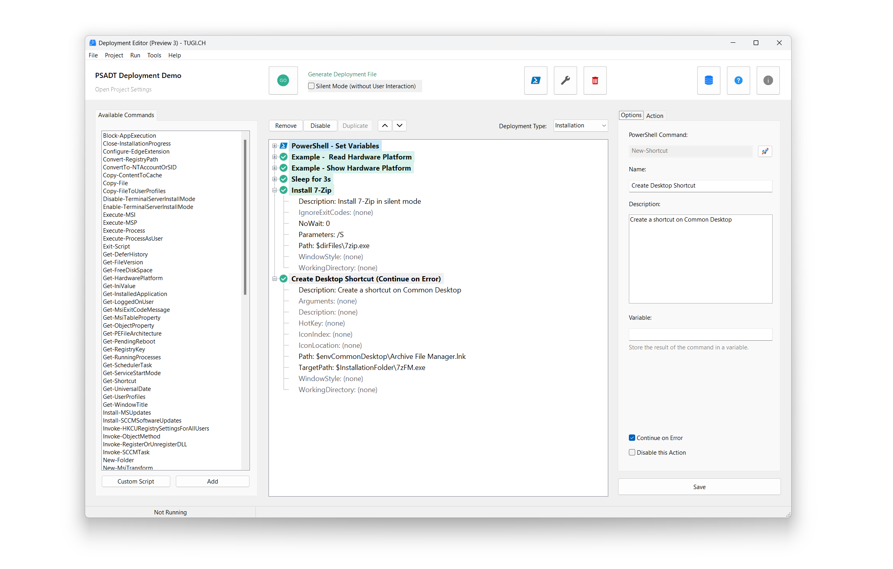

# DeploymentEditor
Visual Software Packaging Editor by TUGI.CH

<!-- ABOUT THE PROJECT -->
## 🧑‍💻 About The Project
**Welcome to the Deployment Editor for PSADT (PSAppDeployToolkit).** This application simplifies the packaging process for all Windows engineers. You can click your sequence for PSADT through the GUI and with just one simple click you get the fully automated coded PowerShell script for the deployment. The best part: It’s free & open-source.  

<!-- GETTING STARTED -->
## ✅ Getting Started

### Requirements
Windows 10/11 64-bit 
(It also runs well on ARM-based Windows via the translation layer.)

### Prerequisites
There are no prerequisites for this tool. All required files are included in this GitHub repository.

### Installation
You can download the latest release from GitHub or use the MSI installer from the releases. 
The editor runs in user context and doesn't require administrator rights. For packaging, you need administrator rights to run a packaging project (in system context).

<!-- USAGE EXAMPLES -->
## 📋 Usage

**Video Tutorial on YouTube:** 
[Deployment Editor - Package Softwares with PSAppDeployToolkit (PSADT)](https://www.youtube.com/watch?v=1Ct5B27BGP4) 
There is also an example that shows a simple sequence for installing and uninstalling 7-Zip. Give it a try and if you have any questions just contact me via email or LinkedIn.

<!-- LICENSE -->
## 📄 License
See `LICENSE.txt` for more information.

<!-- CREDITS -->
## 📄 Credits
[PSAppDeployToolkit/PSAppDeployToolkit](https://github.com/PSAppDeployToolkit/PSAppDeployToolkit) 
See also LICENSE_ThirdParty.txt

<!-- CONTACT -->
## 📧 Contact
TUGI - [contact@tugi.ch](mailto:contact@tugi.ch) 
Project Link: [https://blog.tugi.ch/deployment-editor-preview](https://blog.tugi.ch/deployment-editor-preview)
